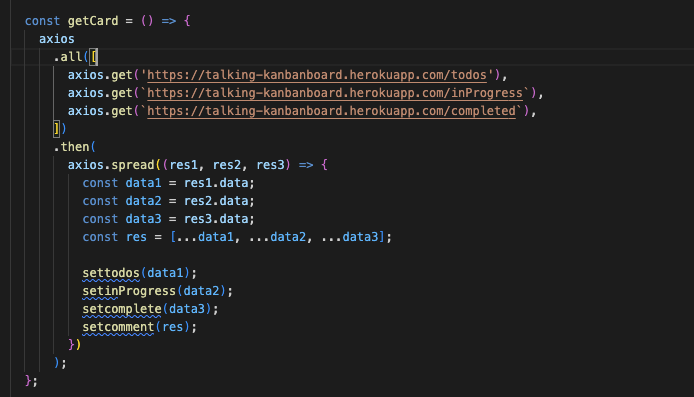
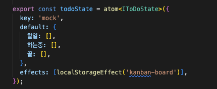
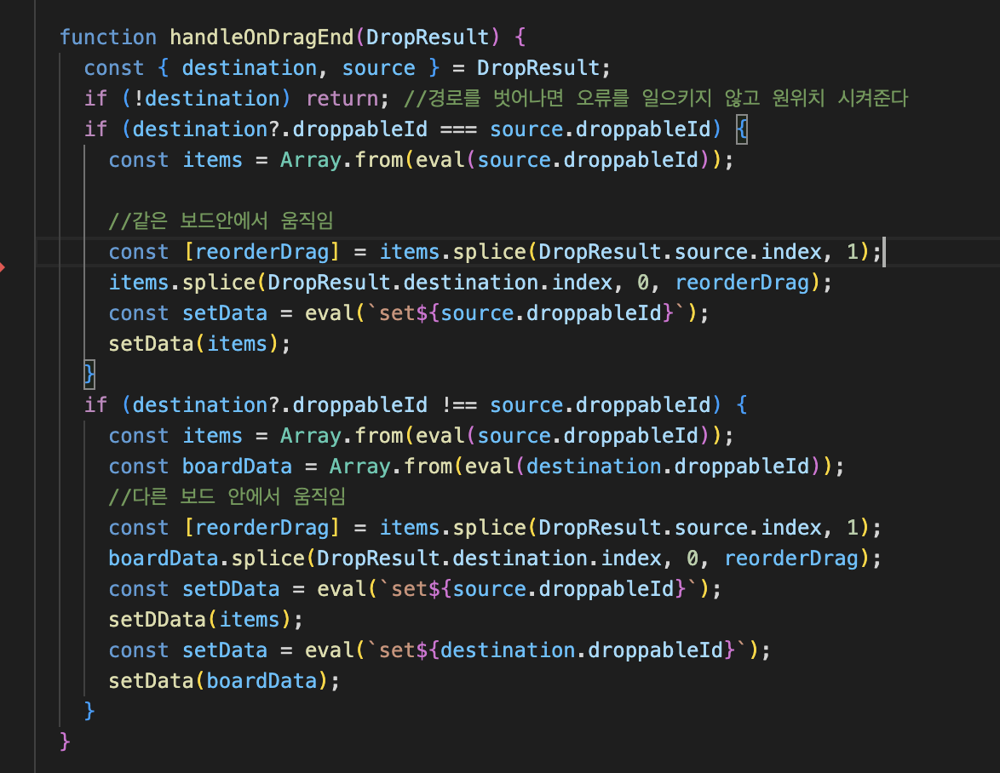
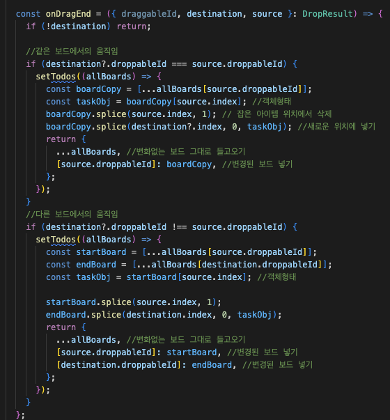

# Talking kanban-board

> P에서 J가 되는 칸반보드  
> **URL** https://talking-kanban-board.netlify.app/

## 1.참여인원

개인프로젝트

 

## 2.사용한 기술

- **기술스택**  
  TypeScript /React / JavaScript(ES6) /Recoil

- **주요 라이브러리 및 협업 툴**  
  주요 라이브러리: react-beautiful-dnd / styled-components / react-hook-form / web speech api  
  배포: Netlify

 

## 3.핵심 기능

- 글 내용 작성 후 버튼 또는 엔터 클릭 시 todo에 카드생성

- 음성 이모지를 누른 후 음성인식을 통해 글 내용이 자동생성

- 보드 추가 및 삭제 기능

- 보드 내, 보드 간에 카드 드레그 기능

- 카드 내용 수정 및 삭제 기능

- 다크모드 기능

- Localstorage 저장기능

   

## 4.트러블 슈팅

#### 📌 state관리

처음에 프로젝트를 구상하였을 때는 `json-server`라이브러리를 통해 crud를 구축하려고 하였다.

문제는 json-server는 간소하게 작동하는 백엔드였기 때문에 json객체를 입맛대로 수정할 수 없었다.

처음에는 2중배열로 구성된 URL 수정해서 axios로 받아올 수 없어서 state를 3개로 만들어 카테고리를 나눠주는 방법을 사용했다

이전코드보기

   

 

이 방법을 사용하면서 수많은 문제들이 나타났다

첫째, 추가적으로 카테고리 보드를 만들 수 없다

둘째, 단순히 값만 받아와서 보여주는 것이 아니라 카테고리를 이동해야한다(각각의 state으로서 의미가 없다)

셋째, state값을 따로 관리하기 때문에 component화 시키기 어렵다

결국 동작은 하지만 코드의 효율성이 전혀 없는 지저분한 코드가 되었다

효율적인 코드를 위해 recoil을 사용해서 카테고리를 한 state로 관리하는 방법으로 변경하였고 위 3가지 문제를 모두 개선할 수 있었다

현재코드보기

   

 

#### 📌 드레그 앤 드롭

프로젝트 중 가장 어려웠던 부분이 같은 보드 안에서 이동과 다른 보드 간의 이동을 만들어내는 부분이였다. 이는 칸반보드의 핵심 기능으로 기능구현을 위해 `react-beautiful-dnd` 라이브러리를 사용했다.

보드간에 자유로운 움직임을 만들기 위해서는 라이브러리와 카드 이동에 따른 state 변화에 대한 이해가 필요했다.

> **같은 보드에서의 움직임**  
> ex)한 보드에서 3번째 카드를 첫번째 카드위치로 옮기기
>
> 1.  `{[id:1,text:bear],[id:2,text:cat],[id:3,text:dog]}` 보드 데이터를 그대로 복사한다
> 2.  `[id:3,text:dog]`이동할 배열을 찾는다(잡은카드)
> 3.  `{[id:1,text:bear],[id:2,text:cat]}` splice(시작위치,1)함수로 객체에서 이동할 배열을 삭제시켜준뒤
> 4.  `{[id:3,text:dog],[id:1,text:bear],[id:2,text:cat]}` splice(도착위치,0,이동할배열) 이동한 위치에 다시 넣어준다
> 5.  변경된 4번의 보드를 변경되지 않은 보드들과 함께 다시 리턴해준다

 

> **다른 보드에서의 움직임**  
> ex) 시작보드에 있는 마지막 카드를 도착 보드의 맨 앞에 넣기
>
> 1.  `{[id:1,text:bear],[id:2,text:cat],[id:3,text:dog]}` 시작 보드를 복사(잡은 카드가 있는 보드)
> 2.  `{[id:1,text:javascript],[id:2,text:java],[id:3,text:python]}` 도착 보드를 복사(카드가 옮겨갈 보드)
> 3.  `[id:3,text:dog]` 이동할 배열을 찾는다(잡은카드)
> 4.  `{[id:1,text:bear],[id:2,text:cat]}` splice(시작위치,1)함수로 객체에서 이동할 배열을 삭제시켜준뒤
> 5.  ``{[id:0,text:dog],[id:1,text:javascript],[id:2,text:java],[id:3,text:python]}` ` splice(도착위치,0,이동할배열) 이동한 위치에 다시 넣어준다
> 6.  변경된 각각의 4번과 5번 보드를 변경되지 않은 보드들과 함께 다시 리턴해준다

 

**json-server를 사용한 state관리>**

데이터를 각각의 state로 만들었기 때문에 이동하면서 바뀐 state 위치에 넣어주는 작업이 필요했다.

시작 state에서 도착한 state로 데이터를 옮겨주기 위해 eval()함수를 사용해서 stirng값을 변수로 바꿔서 넣어주었다

코드보기

   

 

**Recoil를 사용한 state관리>**

하나의 state로 카테고리를 관리하기 때문에 state값을 복사해서 변경된 부분만 바꿔서 다시 setter함수에 넘겨주는 방법으로 데이터를 바꿔줄 수 있었다

코드보기

   

 

## 5.회고

수학 문제를 풀 때 개념을 모르는 채 문제 풀이만 하면 결국 나중에 같은 문제를 만났을 때 풀 수 없다. 문제 풀이에만 급급해서 개념을 정확히 익히지 않는다면 문제를 통해 학습한 것이 아니라 맞춘 것으로 그치고 만다.

프로젝트를 하면서 기능 구현에만 집착하고 있는 자신을 발견하였다. 효율적이지 못한 방법이라는 것을 알면서도 동작한다는 것에 의의를 두며 진행해나갔다.

찝찝한 마음으로 프로젝트를 끝낸 후, 코드의 오류를 줄여 최적화시켜주는 typescript와 효율적으로 state를 관리해 줄 recoil을 학습한 후 얼마나 잘못된 생각으로 프로젝트를 진행하였는지를 깨닫고 모든 코드를 갈아엎었다.

물론 지금의 코드도 미숙하고 이보다 더 좋은 코드가 많을 거라 생각한다.

하지만 이번 프로젝트를 계기로 더 좋은 해답을 찾기 위해 노력하는 개발자로 성장했다는 것에 큰 의미가 있다고 생각한다.
